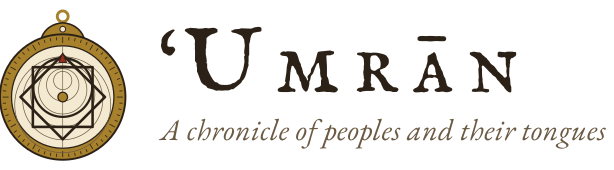
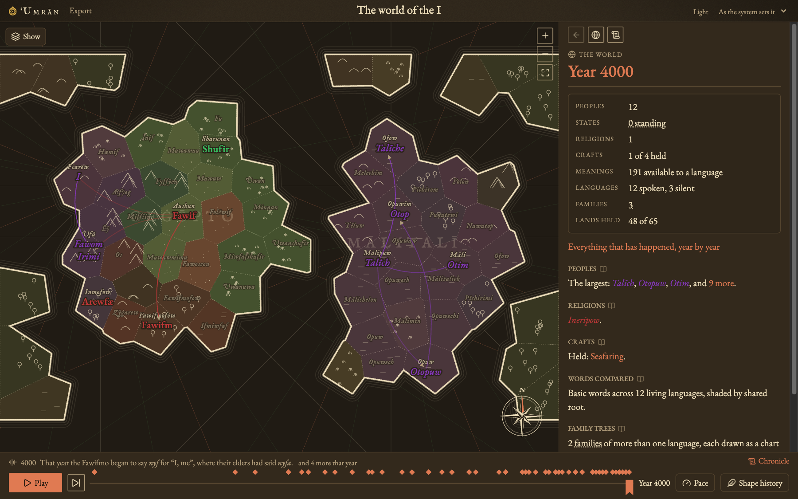
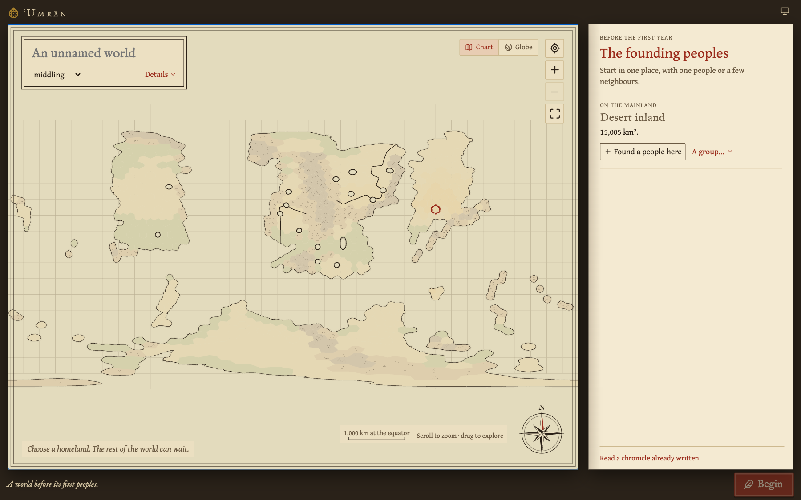
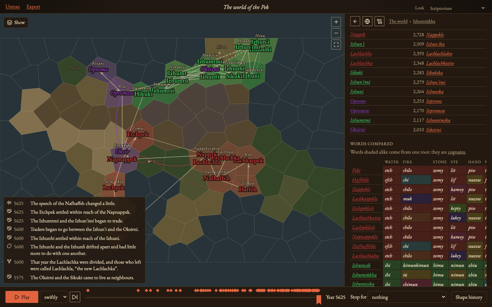
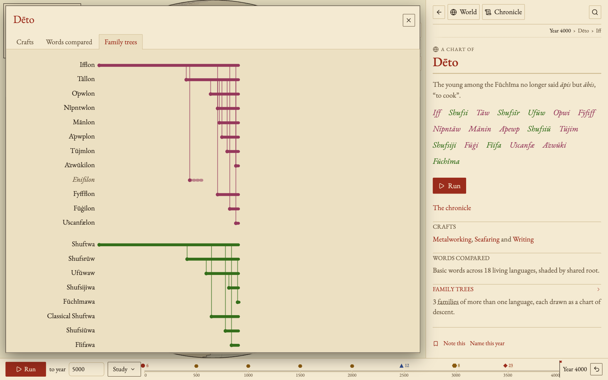
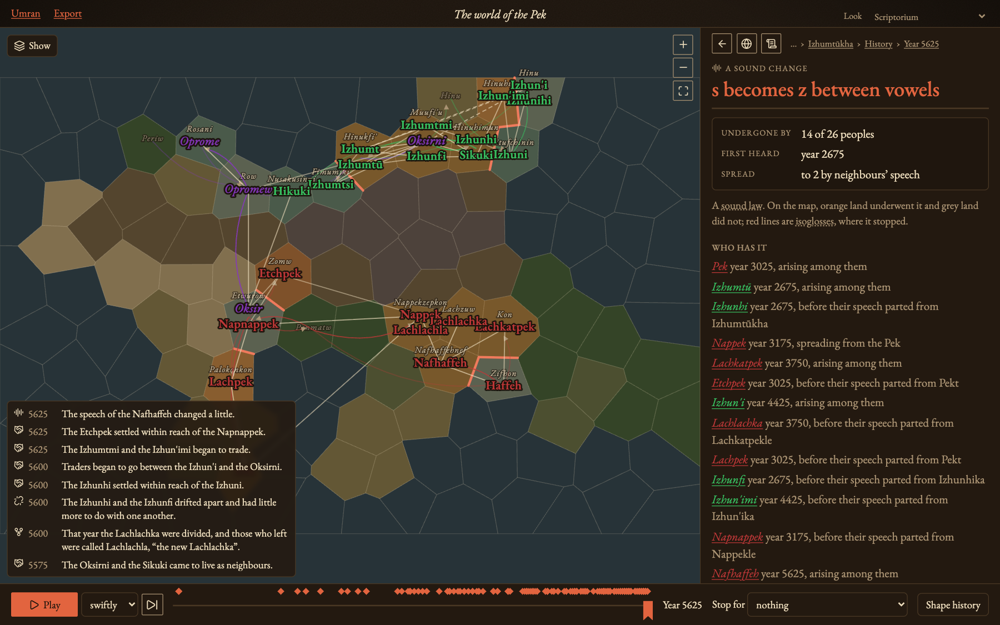

<picture>
  <source media="(prefers-color-scheme: dark)" srcset="docs/images/logo-dark.svg" />
  
</picture>

[](https://github.com/solforged/umran/actions/workflows/ci.yml)
[](https://solforged.github.io/umran/)
[](LICENSE)

A world simulator where languages change the way real ones do. Peoples
settle a map, grow, split, trade, conquer, and give up their languages, and
every word they speak changes in response: sounds shift regularly, words
are borrowed and compete, names wear down, and families of related
languages branch out. It runs entirely in the browser.

**[Try it in your browser](https://solforged.github.io/umran/)**: choose
"Watch a sample world" to open one already four thousand years along.



## What happens in a world

You draw a map, choose a few founding peoples, and decide how their
languages sound. Then time passes in 25-year generations, and the world
writes its own history.

- **Sound change.** Each generation a language may take up a sound law,
  such as "s becomes z between vowels". Laws apply to every word at once,
  as real sound changes do, and the odds favour changes the speakers'
  sound preferences like.
- **Waves.** A sound change can spread to neighbouring languages, mostly
  between close relatives. The lines where a change stopped (isoglosses)
  cut across the family tree, as dialect maps of real languages do.
- **Words compete.** Every meaning has one or more words competing for
  use. New words arise, old ones are renewed when they wear too short or
  sound like another word, and losers fall out of use.
- **Borrowing.** Peoples in contact trade words, mostly from the more
  prestigious side. How readily a meaning is borrowed comes from that
  meaning alone, so patterns by field have to emerge on their own.
- **Peoples on a map.** Peoples forage, herd, or farm, and grow toward
  what their lands feed them. Farmers fill the plains and spread into
  land beside them; a people grown too large or too far-flung splits
  along its lands. Peoples migrate, cross the sea, meet as neighbours,
  trade, conquer one another, and learn new ways of life from each other.
  Famine, plague, and drought strike; small peoples die out or are
  absorbed by larger kin.
- **States and standard languages.** Peoples conquer one another, or a
  large farming people under pressure organizes itself, and a state
  arises with a capital city its tribute feeds. In time its court's
  speech becomes a standard: it changes slowly, pulls its kindred
  dialects toward it, and draws subjects of other families to shift to
  it. Some standards keep foreign words out. When the state falls, its
  dialects drift apart again, as Latin did into the Romance languages.
- **Classical languages.** A written standard is in time fixed as it
  stood, by grammarians or by its state's fall, and people go on writing
  it while their speech moves on, as Latin was written over Romance
  Europe. It lends learned words to its daughters until they are written
  in their own right, by a new state or a translated scripture.
- **Crafts, faiths, and writing.** Metalworking, riding, seafaring, and
  writing begin where they can and pass from people to people, and each
  brings words a language lacked: borrowed from the teachers, stretched
  from old words ("write" from "scratch"), or built. A teacher may found a
  faith whose frozen speech becomes a sacred language, lending learned
  words long after and turning converts' old gods into demons. Writing
  fixes spelling while speech moves on, as English *knight* shows.
- **Personal names.** Each language names its people its own way, from
  words its way of life favours: herders for horses and cattle, farmers
  for grain. Kings and prophets carry such names.
- **Language shift.** A people can give up its language for a more
  prestigious one, keeping its own accent and some old words.
- **Names are words.** Peoples, languages, and lands are named from the
  speakers' own vocabulary ("the people of the river"), and their names
  go through the same sound changes as everything else.

You can stop time at any year, rewind, and try something different. Nothing
is lost: abandoned histories stay readable, struck through.

## A closer look

| | |
|---|---|
|  |  |
| **Setting up a world.** The map is drawn from a seed as an old chart. Each founding people gets an account: what it calls itself, how it lives, how its speech sounds, and its first words. Its sounds can be tuned on a full sound chart. | **Words compared.** Basic words across the living languages, shaded alike when they come from one root (cognates). |
|  |  |
| **A family tree.** Every language card charts its family's descent, its sounds, and how it builds words, here by vowel patterns over consonant roots, as Arabic does. | **A sound law.** Who has a change, whether it arose among them or spread from a neighbour, and on the map, where it stopped. |

## How it is built

- **A Rust engine** (`crates/umran-sim`) holds all the linguistics. It has
  no knowledge of the browser and is tested natively.
- **A WebAssembly facade** (`crates/umran-web`, via `wasm-bindgen`) keeps
  the history and serves the browser ready-to-show JSON views.
- **A React and TypeScript front end** (`web/`, built with Vite) only
  presents. It never makes or changes a word, and there is no backend.

A few decisions do most of the work:

- **Deterministic by construction.** Every random draw comes from its own
  ChaCha8 stream, keyed by what it is for. Adding a new process never
  shifts the draws of existing ones, and the same seed gives the same
  history natively and in WebAssembly.
- **History as a recipe.** A saved world is a seed plus the actions taken.
  Any past year is recovered by replaying, with cached checkpoints, so the
  timeline costs no extra storage and saves are tiny.
- **An honest comparative method.** The code that reconstructs which
  languages are related never reads the true family tree. It is only
  graded against it.
- **Grounded in data.** Sound frequencies come from
  [PHOIBLE](https://phoible.org/), the basic vocabulary is the
  Leipzig–Jakarta list, and borrowing is checked against the
  [World Loanword Database](https://wold.clld.org/). Statistical tests check
  behaviour in bands over many seeds rather than exact outputs.

[`docs/engine.md`](docs/engine.md) describes the model module by module,
and [`docs/history.md`](docs/history.md) covers replay, branching, and
saving.

## Install and use offline

Umran is a progressive web app. After one online visit, the app and its
WebAssembly engine can reopen and run without a connection.

- **Chrome or Edge:** use the install icon in the address bar or the
  browser's install menu.
- **iPhone or iPad:** open it in Safari, then choose Share → Add to Home
  Screen.
- **Safari on Mac:** choose File → Add to Dock.

Worlds stay in local browser storage; installing does not upload or sync
them. Some browsers keep an installed app's storage separate from its
browser tab, so export a recipe and import it in the app if needed. Keep
exported backups; clearing site data can remove both worlds and offline
files.

New editions offer "Save and reload" rather than interrupting playback.
Reloading first saves the latest generation; if saving fails, the update
waits so you can export the world. Other open windows wait for their own
reload.

## Run it locally

You need [rustup](https://rustup.rs/) (the Rust version is pinned in
`rust-toolchain.toml` and installs itself) and [Bun](https://bun.sh/).

```sh
bun install
bun run dev         # builds the WebAssembly and serves http://127.0.0.1:5173
bun run build       # a static site in dist/, all that deployment needs
cargo test --workspace
```

To check the PWA locally, run `bun run build` followed by `bun run preview`
and open `http://127.0.0.1:4173/`. Offline support is enabled only in
production builds; deployment requires HTTPS (localhost also works).
The manifest, icons, and service worker support subpaths such as `/umran/`.
Fonts fetched while the worker is active are cached too; fonts not yet
cached fall back to local serif faces when offline.

The engine also has command-line examples for studying one mechanism at a
time, such as how fast words wear down or how a family drifts apart. They
are listed in [`docs/engine.md`](docs/engine.md#studying-one-mechanism).

## Project layout

```
crates/umran-sim   the engine: world, map, sounds, words, names, history
crates/umran-web   the WebAssembly facade and its JSON views
web/src            the React workbench: shelf, world setup, stage, cards
docs/              the engine model and the history format
brand/             the astrolabe mark; `bun run brand` redraws icons and logos
AGENTS.md          architecture notes and the rules every change keeps
```

## Status

Umran is a work in progress. Not yet modelled: stress, tone, vowel harmony,
inflection, syntax, rivers, and climates, among others. The full
list is at the end of
[`docs/engine.md`](docs/engine.md#not-yet-modelled).

## The name

*ʿUmrān* is Ibn Khaldun's word for settled social life, the subject of his
*Muqaddimah* (1377): how peoples come together, rise, meet, and rule one
another. Umran is a small, playful attempt at the same subject, told
through the words people speak.

The mark is an astrolabe, the brass instrument of his world. Its plates
were engraved one for each clime, the latitude bands Ibn Khaldun used to
divide the inhabited quarter of the earth, *al-rubʿ al-maʿmūr*.

## License

[MIT](LICENSE)
